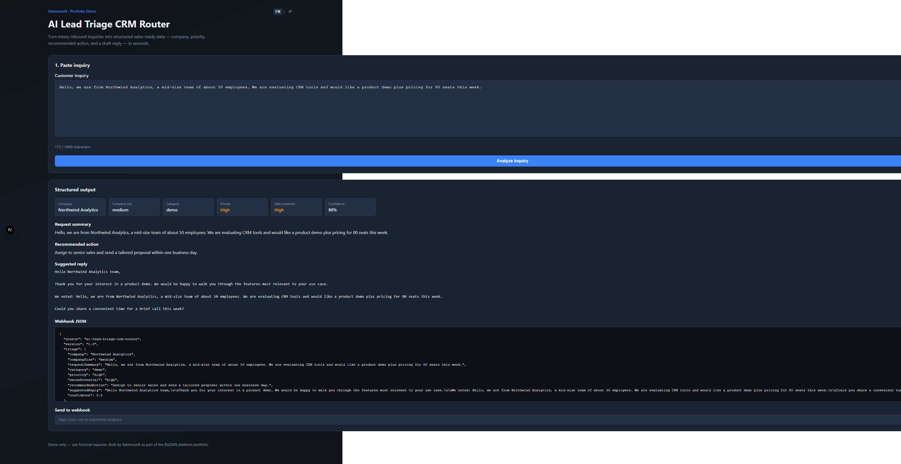
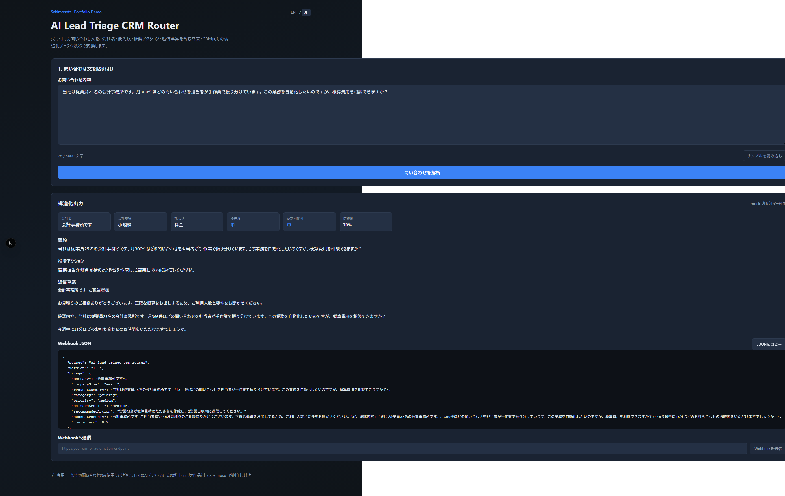
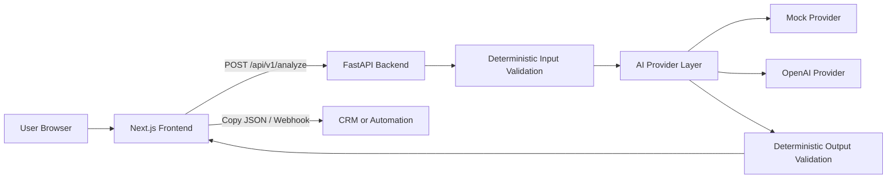

# AI Lead Triage CRM Router

**Turn inbound inquiries into structured sales-ready data — in seconds.**

A portfolio demo by [Sekimosoft](https://sekimosoft.com) from the BizDXAI platform.

**Status:** v1.1.1 — Public on GitHub, CI green, EN / JP UI; Live Demo on Render  
**Repository:** https://github.com/Sekimosoft/ai-lead-triage-crm-router  
**Languages:** EN / JP toggle (default EN) — Mock Provider, no API key required

Copyright © Sekimosoft. No license is granted for reuse.

---

## 1. What it does

Paste a customer inquiry (email, form message, or chat snippet). The app analyzes the text and returns CRM-ready structured data:

| Field | Example |
|---|---|
| **company** | Northwind Analytics |
| **companySize** | medium |
| **requestSummary** | Wants a demo and pricing for 80 seats |
| **category** | demo |
| **priority** | high |
| **salesPotential** | high |
| **recommendedAction** | Assign to senior sales within one day |
| **suggestedReply** | Professional draft reply |
| **confidence** | 0.80 |

You can copy the JSON payload or send it to a webhook endpoint for CRM or automation tools.

---

## 2. Business problem

Sales and support teams receive unstructured inquiry messages every day. Someone must read each one, guess the company and intent, decide priority, and draft a reply — before anything reaches the CRM.

That manual triage is slow, inconsistent, and easy to get wrong when volume spikes.

This demo shows a focused solution: **AI handles ambiguous interpretation; deterministic rules handle business-critical validation.**

---

## 3. Live demo

> Live Demo URL will be added after deployment to Render (frontend + backend).  
> The demo runs on **Mock Provider** by default — no OpenAI API key required.

**Run locally now:**

```bash
cp .env.example .env
# Terminal 1 — backend
cd backend && pip install -r requirements.txt && uvicorn app.main:app --port 8000
# Terminal 2 — frontend
cd frontend && npm install && npm run dev
```

Open http://localhost:3000

---

## 4. Screenshots

Sample inquiry only — no real customer data. Toggle **EN / JP** in the header (default EN).

| English | Japanese |
|---|---|
|  |  |

Full-resolution captures (input + result): [docs/assets/](./docs/assets/)

---

## 5. How it works

1. User pastes an inquiry into the web form.
2. Frontend validates length locally, then sends the text to the backend API.
3. Backend runs **deterministic input validation** (required, min/max length).
4. An **AI provider** interprets the text into structured fields (mock provider by default — no API key needed).
5. Backend runs **deterministic output validation** (confidence threshold, company name, sensitive-data guard).
6. Valid results are shown in the UI with JSON copy and optional webhook delivery.

If validation fails, the app returns clear issues instead of silently passing bad data to sales systems.

---

## 6. Architecture



**Stack**

- **Frontend:** Next.js 15, TypeScript, React 19
- **Backend:** FastAPI, Python 3.12, Pydantic v2
- **AI:** Pluggable provider interface (`mock` | `openai`)
- **Database:** None in V1 — stateless by design

---

## 7. Design principles

- **Business outcome before technology** — every field maps to a sales or support action.
- **AI only where ambiguity requires it** — classification and summarization, not rule enforcement.
- **Deterministic validation for business-critical rules** — length, confidence, sensitive data checks.
- **Fail safely** — validation errors block automated routing; no silent bad output.
- **No real customer data in demo** — use fictional sample inquiries only.
- **Simple architecture before unnecessary scale** — no database, queue, or auth in V1.

---

## 8. Key design decisions

| Decision | Rationale |
|---|---|
| Mock provider as default | Portfolio demo works without API keys or cost |
| Mock provider scope | Supports representative demo patterns (including common Japanese legal-entity forms). For free-form semantic interpretation, use the OpenAI Provider |
| EN / JP UI toggle | Direct sales value in overseas and Japanese markets without a full i18n platform |
| Provider interface | Swap to OpenAI (or others) via one env variable |
| Validation after AI | AI interprets; code decides if output is safe to route |
| Webhook payload as first-class output | CRM integrations often start with HTTP hooks, not DB sync |
| No database in V1 | Avoids over-engineering for a stateless triage demo |
| Separate frontend and backend | Clear API boundary; easy to test and deploy independently |

---

## 9. How to run

### Prerequisites

- Python 3.12+
- Node.js 22+
- (Optional) Docker and Docker Compose

### Quick start — local development

**1. Clone and configure**

```bash
cp .env.example .env
```

**2. Backend**

```bash
cd backend
python -m venv .venv
# Windows
.venv\Scripts\activate
# macOS / Linux
source .venv/bin/activate

pip install -r requirements.txt
uvicorn app.main:app --reload --port 8000
```

API docs: http://localhost:8000/docs

**3. Frontend** (separate terminal)

```bash
cd frontend
npm install
npm run dev
```

App: http://localhost:3000

### Docker Compose

```bash
docker compose up --build
```

- Frontend: http://localhost:3000
- Backend: http://localhost:8000

### Switch to real AI (OpenAI)

```env
AI_PROVIDER=openai
OPENAI_API_KEY=sk-your-key-here
OPENAI_MODEL=gpt-4o-mini
```

Restart the backend after changing provider settings.

---

## 10. Testing

**Backend**

```bash
cd backend
pip install -r requirements.txt
pytest -v
```

**Frontend**

```bash
cd frontend
npm install
npm test
npm run lint
npm run build
```

**CI:** GitHub Actions runs backend tests, frontend tests, lint, and production build on push/PR.

| Suite | Status |
|---|---|
| Backend pytest (16 tests) | Pass — local and CI |
| Frontend vitest (7 tests) | Pass — local and CI |
| ESLint | Pass — local and CI |
| Production build | Pass — CI (Ubuntu); on Windows, `next build` may fail on mapped drives (`K:`) due to a Next.js/readlink environment issue — not a project code defect |

---

## 11. Security and privacy

- **Demo only** — do not submit real customer PII, credentials, or payment data.
- **No data persistence** — inquiries are processed in memory and not stored.
- **Input/output validation** — blocks empty, oversized, or suspicious content before routing.
- **Webhook URLs are user-supplied** — only send to endpoints you control; the backend does not whitelist destinations in V1.
- **API keys** — keep `OPENAI_API_KEY` in `.env`; never commit secrets.
- **CORS** — restrict `CORS_ORIGINS` in production to your frontend domain.

---

## API reference (V1)

### `POST /api/v1/analyze`

**Request**

```json
{ "inquiryText": "Hello from Acme Corp, we need a demo this week..." }
```

**Response (success)**

```json
{
  "success": true,
  "result": { "company": "Acme Corp", "companySize": "medium", "...": "..." },
  "validationIssues": [],
  "provider": "mock",
  "webhookPayload": { "source": "ai-lead-triage-crm-router", "version": "1.0", "triage": {}, "metadata": {} }
}
```

### `POST /api/v1/webhook`

**Request**

```json
{
  "url": "https://your-endpoint.example/hook",
  "payload": { "source": "ai-lead-triage-crm-router", "version": "1.0", "triage": {}, "metadata": {} }
}
```

---

## License

Copyright © Sekimosoft. No license is granted for reuse.

---

## About

Built by **Sekimosoft** as portfolio work on the **BizDXAI** platform.  
Repository name intentionally avoids product branding — the focus is the business outcome, not the platform label.
